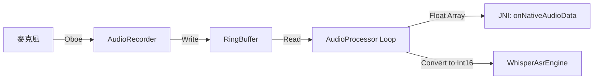
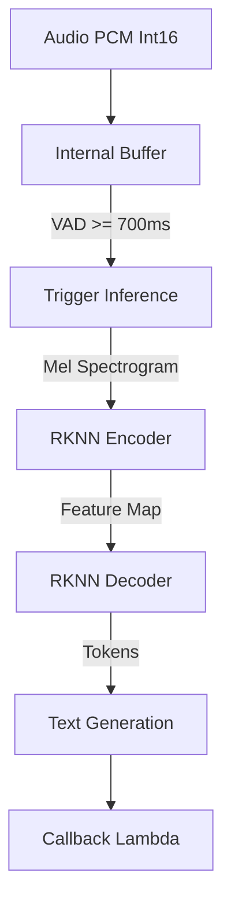

# RK Whisper 整合與完整資料流分析

本文件說明如何在 EdgeMeetingSDK 中整合 RK3588 Whisper ASR 功能，並詳細拆解從麥克風收音到 UI 顯示文字的完整資料流。

## 1. RK Whisper 導入方式

整合 RK Whisper 主要涉及 **模型部署** 與 **Native 函式庫** 的配置。

### 1.1 核心元件
1.  **RKNN Runtime (`librknnrt.so`)**: Rockchip NPU 的推理引擎。
2.  **Whisper 模型 (`.rknn`)**: 包含 Encoder 與 Decoder 兩個模型檔。
    *   `whisper_encoder_base_20s.rknn`
    *   `whisper_decoder_base_20s.rknn`

### 1.2 檔案配置結構
在 `meeting-engine` 模組中配置如下：

```text
meeting-engine/
├── src/main/
│   ├── assets/
│   │   └── models/               <-- 存放 .rknn 模型檔
│   │       ├── whisper_encoder_base_20s.rknn
│   │       └── whisper_decoder_base_20s.rknn
│   └── jniLibs/
│       └── arm64-v8a/
│           └── librknnrt.so      <-- 存放 RKNN Runtime
```

### 1.3 建置設定 (Build Configuration)
在 `meeting-engine/src/main/cpp/CMakeLists.txt` 中連結函式庫：

```cmake
# 連結 RKNN Runtime
add_library(rknnrt SHARED IMPORTED)
set_target_properties(rknnrt PROPERTIES IMPORTED_LOCATION
    ${CMAKE_SOURCE_DIR}/../jniLibs/${ANDROID_ABI}/librknnrt.so)

target_link_libraries(
    meeting-engine
    # ... 其他依賴 (oboe, log 等)
    rknnrt
)
```

---

## 2. 完整資料流 (Data Flow)

資料流從硬體麥克風開始，經過 C++ 音訊處理、ASR 推理，最後透過 JNI 回傳至 Kotlin 層並更新 UI。

### 2.1 階段一：音訊採集與分流 (Native C++)

**核心元件**: `AudioRecorder`, `AudioProcessor`

1.  **麥克風輸入 (`AudioRecorder`)**:
    *   使用 Oboe (AAudio) 建立 Low Latency Input Stream。
    *   Callback `onAudioReady` 收到 PCM Float 資料。
    *   寫入 **Ring Buffer** (緩衝區)。

2.  **音訊處理執行緒 (`AudioProcessor::workerLoop`)**:
    *   獨立 Thread 從 Ring Buffer 讀取音訊塊 (Chunk, e.g., 160ms)。
    *   **分流 A (波形圖)**: 直接將 float array 透過 JNI 送往 Kotlin (`onNativeAudioData`)。
    *   **分流 B (ASR 推理)**:
        *   格式轉換: Float (`-1.0` ~ `1.0`) -> Int16 (`-32768` ~ `32767`)。
        *   呼叫 `AsrEngine::pushAudio(int16_t* data, size_t size)`。



### 2.2 階段二：ASR 推理與特徵提取 (Native C++)

**核心元件**: `WhisperAsrEngine`, `RKNN Runtime`

1.  **特徵提取 (Feature Extraction)**:
    *   `WhisperAsrEngine` 內部累積音訊樣本。
    *   計算 Log-Mel Spectrogram (Whisper 模型的輸入特徵)。

2.  **語音活動偵測 (VAD / Segmentation)**:
    *   偵測靜音 (Silence) >= 700ms。
    *   觸發切段，準備進行推理。

3.  **NPU 推理 (Inference)**:
    *   **Encoder**: 將 Mel Spectrogram 輸入 NPU (RK3588)，產出 Feature Map。
    *   **Decoder**: 根據 Feature Map 進行 Beam Search 解碼，生成文字 Tokens。

4.  **結果生成**:
    *   將 Tokens 解碼為 UTF-8 字串。
    *   生成 `TranscriptSegment` 物件 (含文字、起訖時間、語言代碼)。



### 2.3 階段三：跨語言回調 (JNI Boundary)

**核心元件**: `native-lib.cpp`, `JniEngineBridge`

1.  **C++ Callback**:
    *   `WhisperAsrEngine` 執行完成後呼叫預先註冊的 Lambda。
    *   Lambda 內檢查並 Attach 目前 Thread 到 JVM。

2.  **JNI Method Call**:
    *   呼叫 Kotlin 方法：`JniEngineBridge.onNativeTranscript(...)`。
    *   參數包含：`segmentId`, `text`, `isFinal`, `startTime`, `endTime`, `languageCode`。

### 2.4 階段四：應用層狀態更新 (Kotlin & UI)

**核心元件**: `EngineBridge`, `RkMeetingSession`, `ViewModel`, `Compose UI`

1.  **橋接層 (`EngineBridge`)**:
    *   接收 JNI 回調，封裝成 Kotlin Data Class `TranscriptSegment`。
    *   透過 `EngineCallback` 介面通知上層。

2.  **會話管理 (`RkMeetingSession`)**:
    *   `_transcriptFlow` (MutableSharedFlow) 接收新段落。
    *   發送資料給所有訂閱者。

3.  **UI 呈現 (`MeetingViewModel` -> `Compose`)**:
    *   UI 觀察 `transcriptFlow`。
    *   接收到新文字段落，更新 `LazyColumn` 列表顯示即時字幕。

## 總結資料流圖

```text
[Hardware]      Mic
                 │
[C++ Native]    AudioRecorder (Oboe)
                 │
                RingBuffer
                 │
                AudioProcessor (Thread)
                 │ (Int16 PCM)
                 ▼
                WhisperAsrEngine
                 │ (Accumulate -> VAD -> RKNN Inference)
                 ▼
[JNI]           native-lib.cpp (Callback Lambda)
                 │ (JNI Call)
                 ▼
[Kotlin]        JniEngineBridge.onNativeTranscript()
                 │
                EngineBridge (Callback)
                 │
                RkMeetingSession (Flow emit)
                 │
[UI Layer]      ViewModel -> Jetpack Compose Text
```
